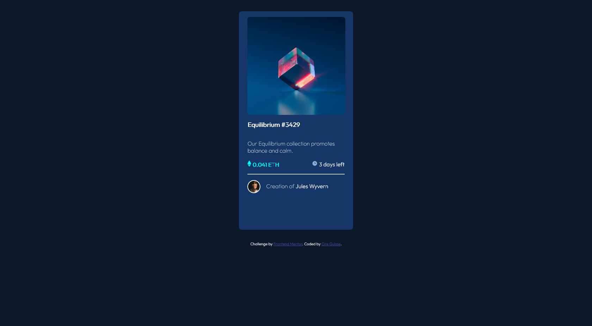
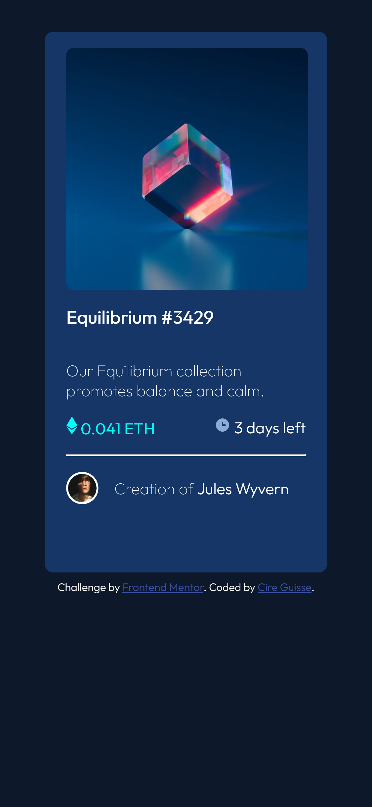

# Frontend Mentor - NFT preview card component

This is a solution to the [NFT preview card component challenge on Frontend Mentor](https://www.frontendmentor.io/challenges/nft-preview-card-component-SbdUL_w0U). Frontend Mentor challenges help you improve your coding skills by building realistic projects. 

## Table of contents

- [Frontend Mentor - NFT preview card component](#frontend-mentor---nft-preview-card-component)
  - [Table of contents](#table-of-contents)
  - [Overview](#overview)
    - [The challenge](#the-challenge)
    - [Screenshot](#screenshot)
    - [Links](#links)
  - [My process](#my-process)
    - [Built with](#built-with)
    - [What I learned](#what-i-learned)
    - [Continued development](#continued-development)
    - [Useful resources](#useful-resources)
  - [Author](#author)

**Note: Delete this note and update the table of contents based on what sections you keep.**

## Overview

### The challenge

Users should be able to:

- View the optimal layout depending on their device's screen size
- See hover states for interactive elements

### Screenshot

### Links

- Solution URL: [Add solution URL here](https://github.com/GuisseMaabo/NFT_CardComponent)
- Live Site URL: [Add live site URL here](https://nft-card-component-mu.vercel.app/)

## My process

### Built with

- HTML5 
- CSS 
- Mobile-first workflow

### What I learned

Through this callenge I've learn a lot on how to structure my html tags and the usage of selectors classes. I've also improve my abilities on box-sizing and positionning. 
I have more understanding on margins and paddings.
Using css units like : vh, % , em, and px make me understand more about their impact on the responsive aspect of my app. 

### Continued development

As we start the year 2022, this Challenge is the first I've realised and will continue making new challenges and projects that.
So as feel more confortable in all the concepts I'm not really confortable. And discover new areas of web development.

### Useful resources

-  - This helped me  a lot master some notions.
-  - Same for this too 
- 

## Author

- Frontend Mentor - [@GuisseMaabo](https://www.frontendmentor.io/profile/GuisseMaabo)
- Twitter - [@Cireii](https://twitter.com/Cireii)

